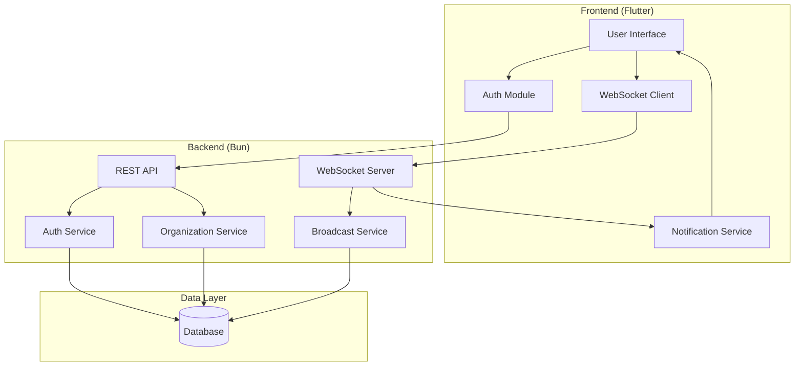
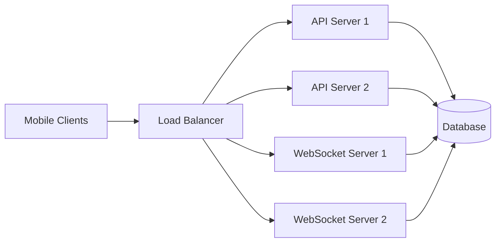

# Design Document

## Overview

Phantom Ping is a real-time group pager system built as a monorepo with a Flutter mobile frontend and Bun backend. The system enables hierarchical organization management with Owner, Admin, Supervisor, and Normal User roles. Organizations can create topic-based sub-meshes for targeted messaging with three severity levels (low, medium, high) that trigger different notification patterns.

### Key Design Principles

1. **Organization Independence:** Each organization operates as an isolated mesh network with its own users, topics, and messages. Organization IDs are user-provided (max 15 characters) to enable memorable identifiers.

2. **Role-Based Hierarchy:** Clear role hierarchy (Owner > Admin > Supervisor > Normal User) with strict permission boundaries. Admin and Supervisor roles are mutually exclusive to prevent authorization ambiguity.

3. **PIN-Based Authentication:** Users authenticate with PIN + Organization ID. PINs are unique within each organization but reusable across organizations, balancing security with usability.

4. **Severity-Based Notifications:** Three-tier notification system (low/medium/high) provides escalating alert patterns, with high-severity messages persisting until acknowledged.

5. **Real-Time Delivery:** WebSocket-based message delivery ensures instant notification with automatic reconnection and message queuing for offline scenarios.

## User Flows

### Organization Creation Flow

1. User opens app and selects "Create Organization"
2. User provides Organization ID (max 15 characters), organization name, owner name, and owner email
3. System validates Organization ID uniqueness and length
4. System creates organization and owner user with auto-generated PIN
5. System displays owner PIN with copy functionality
6. Owner logs in with PIN + Organization ID

**Design Rationale:** The organization creation flow is separate from login to clearly distinguish between creating a new organization (one-time setup) and joining an existing organization (ongoing use). The owner PIN is displayed once after creation, emphasizing the need to save it securely.

### User Registration Flow (Admin/Owner)

1. Admin/Owner navigates to user management screen
2. Admin/Owner enters new user details (name, email, role)
3. System generates unique PIN within organization scope
4. System displays generated PIN for distribution to user
5. New user logs in with PIN + Organization ID

**Design Rationale:** Admins/Owners register users and distribute PINs out-of-band (e.g., in person, secure channel). This centralized registration model ensures organization control over membership.

### Message Broadcast Flow

1. Owner/Admin/Supervisor navigates to broadcast composer
2. User selects severity level (low/medium/high)
3. User selects scope (organization/topic) - Owner/Admin only; Supervisors auto-scoped to assigned topic
4. User enters title, message, and optional code
5. System validates permissions and delivers message via WebSocket
6. Recipients receive notification based on severity level and notification status
7. Recipients acknowledge message to stop alerts

**Design Rationale:** The broadcast flow is streamlined for urgent communication. Supervisors have simplified UI (no scope selection) to reduce cognitive load and prevent errors. High-severity messages require acknowledgement to ensure critical communications are confirmed.

## Architecture

### High-Level Architecture



### Technology Stack

**Frontend:**
- Flutter (Dart) for cross-platform mobile development
- WebSocket client for real-time message delivery
- Local storage for user preferences and message history
- Platform-specific notification APIs (vibration, sound, screen pulse)

**Backend:**
- Bun runtime with TypeScript
- WebSocket server for real-time communication
- REST API for CRUD operations
- SQLite or PostgreSQL for data persistence
- JWT for authentication

## Components and Interfaces

### Standard API Response Format

**All backend API endpoints follow a consistent response structure:**

```typescript
interface ApiResponse<T = any> {
  status: boolean;      // true for success, false for error
  message: string;      // Human-readable message describing the operation result
  data: T;             // Response payload (success data or error details)
}
```

**Design Decision - Unified Response Format:** A consistent response structure across all endpoints simplifies client-side error handling and response parsing. The `status` boolean provides immediate success/failure indication, `message` offers user-friendly feedback, and `data` contains the actual payload or error details (including error codes).

**Success Response Example:**
```typescript
{
  status: true,
  message: "User created successfully",
  data: {
    userId: "01234567-89ab-cdef-0123-456789abcdef",
    pin: "123456"
  }
}
```

**Error Response Example:**
```typescript
{
  status: false,
  message: "Organization ID already exists",
  data: {
    code: "ORG_ID_EXISTS",
    organizationId: "FIRE-DEPT-01"
  }
}
```

### Backend Components

#### 1. Authentication Service

**Responsibilities:**
- Validate PIN + Organization ID credentials
- Generate and verify access tokens (JWT)
- Generate and manage refresh tokens
- Handle token refresh flow
- Invalidate tokens on logout

**API Endpoints:**
```typescript
POST /api/auth/login
Body: { pin: string, organizationId: string }
Success Response: { 
  status: true,
  message: "Login successful",
  data: {
    accessToken: string, 
    refreshToken: string,
    user: UserProfile 
  }
}
Error Response: {
  status: false,
  message: "Invalid PIN or Organization ID",
  data: { code: "AUTH_INVALID_CREDENTIALS" }
}

POST /api/auth/refresh
Body: { refreshToken: string }
Success Response: { 
  status: true,
  message: "Token refreshed successfully",
  data: {
    accessToken: string, 
    refreshToken: string 
  }
}
Error Response: {
  status: false,
  message: "Invalid or expired refresh token",
  data: { code: "AUTH_UNAUTHORIZED" }
}

POST /api/auth/logout
Headers: { Authorization: Bearer <token> }
Body: { refreshToken: string }
Success Response: { 
  status: true,
  message: "Logout successful",
  data: {}
}
Error Response: {
  status: false,
  message: "Invalid token",
  data: { code: "AUTH_UNAUTHORIZED" }
}
```

#### 2. Organization Service

**Responsibilities:**
- Create and manage organizations (generate or validate unique organization IDs, max 15 characters)
- Handle user registration and role management
- Manage topics and user assignments
- Generate unique PINs for users within organizations (unique per organization, reusable across organizations)
- Generate UUIDv7 for all entity IDs except organization ID
- Enforce role exclusivity (Admin and Supervisor roles are mutually exclusive)

**Design Decision - Organization ID:** The system accepts user-provided organization IDs (max 15 characters) rather than auto-generating them. This allows organizations to use memorable, meaningful identifiers (e.g., "FIRE-DEPT-01", "HOSPITAL-ER") which improves usability for PIN-based authentication. The system validates uniqueness and length constraints.

**Design Decision - PIN Scope:** PINs are unique within each organization but can be reused across different organizations. This design balances security (unique within scope) with scalability (allows simple numeric PINs without global collision concerns).

**API Endpoints:**
```typescript
POST /api/organizations
Body: { 
  organizationId: string, // User-provided, max 15 characters, must be unique
  organizationName: string,
  ownerName: string, 
  ownerEmail: string 
}
Success Response: { 
  status: true,
  message: "Organization created successfully",
  data: {
    organizationId: string, 
    ownerId: string, // Auto-generated UUIDv7
    ownerPin: string 
  }
}
Error Response: {
  status: false,
  message: "Organization ID already exists",
  data: { code: "ORG_ID_EXISTS", organizationId: string }
}

POST /api/organizations/:orgId/users
Body: { name: string, email: string, role: 'normal' | 'admin' | 'supervisor', topicId?: string }
Success Response: { 
  status: true,
  message: "User registered successfully",
  data: { userId: string, pin: string }
}
Error Response: {
  status: false,
  message: "Supervisor role requires topic assignment",
  data: { code: "SUPERVISOR_TOPIC_REQUIRED" }
}

PUT /api/organizations/:orgId/users/:userId/role
Body: { role: 'normal' | 'admin' | 'supervisor', topicId?: string }
Success Response: { 
  status: true,
  message: "User role updated successfully",
  data: { userId: string, role: string }
}
Error Response: {
  status: false,
  message: "Cannot be Admin and Supervisor simultaneously",
  data: { code: "ROLE_CONFLICT" }
}

DELETE /api/organizations/:orgId/users/:userId
Success Response: { 
  status: true,
  message: "User removed successfully",
  data: { userId: string }
}
Error Response: {
  status: false,
  message: "User lacks required permissions",
  data: { code: "PERMISSION_DENIED" }
}

PUT /api/organizations/:orgId/ownership
Body: { newOwnerId: string }
Success Response: { 
  status: true,
  message: "Ownership transferred successfully",
  data: { oldOwnerId: string, newOwnerId: string }
}
Error Response: {
  status: false,
  message: "Can only transfer ownership to existing Admins",
  data: { code: "OWNERSHIP_TRANSFER_INVALID" }
}

POST /api/organizations/:orgId/topics
Body: { name: string }
Success Response: { 
  status: true,
  message: "Topic created successfully",
  data: { topicId: string, name: string }
}
Error Response: {
  status: false,
  message: "Organization not found",
  data: { code: "ORG_NOT_FOUND" }
}

POST /api/organizations/:orgId/topics/:topicId/users
Body: { userId: string }
Success Response: { 
  status: true,
  message: "User added to topic successfully",
  data: { topicId: string, userId: string }
}
Error Response: {
  status: false,
  message: "Topic not found",
  data: { code: "TOPIC_NOT_FOUND" }
}

GET /api/organizations/:orgId/topics
Success Response: { 
  status: true,
  message: "Topics retrieved successfully",
  data: { topics: Topic[] }
}
Error Response: {
  status: false,
  message: "Organization not found",
  data: { code: "ORG_NOT_FOUND" }
}
```

#### 3. Broadcast Service

**Responsibilities:**
- Handle message broadcasting
- Validate sender permissions (Owner/Admin can broadcast org-wide or to topics; Supervisors only to their assigned topics)
- Determine organization from authenticated user
- Deliver messages via WebSocket to appropriate recipients
- Track message acknowledgements

**API Endpoints:**
```typescript
POST /api/broadcast
Headers: { Authorization: Bearer <token> }
Body: {
  level: 'low' | 'medium' | 'high',
  title: string,
  message: string,
  code?: string,
  scope: 'organization' | 'topic', // Only for Owner/Admin; Supervisors automatically broadcast to their assigned topic
  topicId?: string // Required if scope is 'topic' and user is Owner/Admin; not needed for Supervisors
}
Success Response: { 
  status: true,
  message: "Message broadcast successfully",
  data: { messageId: string, recipientCount: number }
}
Error Response: {
  status: false,
  message: "User lacks required permissions",
  data: { code: "PERMISSION_DENIED" }
}

Note: For Supervisors, the system automatically uses their assigned topic and ignores scope/topicId parameters

POST /api/messages/:messageId/acknowledge
Body: { userId: string }
Success Response: { 
  status: true,
  message: "Message acknowledged successfully",
  data: { messageId: string, userId: string, acknowledgedAt: string }
}
Error Response: {
  status: false,
  message: "Message not found",
  data: { code: "MESSAGE_NOT_FOUND" }
}

GET /api/messages/history
Query: { organizationId: string, userId: string, limit?: number }
Success Response: { 
  status: true,
  message: "Message history retrieved successfully",
  data: { messages: Message[], count: number }
}
Error Response: {
  status: false,
  message: "User not found",
  data: { code: "USER_NOT_FOUND" }
}
```

**WebSocket Events:**
```typescript
// Server -> Client
event: 'message:broadcast'
payload: {
  messageId: string,
  level: 'low' | 'medium' | 'high',
  title: string,
  message: string,
  code?: string,
  timestamp: string
}

// Client -> Server
event: 'message:acknowledge'
payload: {
  messageId: string,
  userId: string
}
```

#### 4. WebSocket Server

**Responsibilities:**
- Maintain persistent connections with clients
- Route broadcast messages to appropriate users
- Handle connection lifecycle (connect, disconnect, reconnect)

**Connection Management:**
- Authenticate connections using JWT
- Map user IDs to WebSocket connections
- Handle multiple connections per user (multiple devices)
- Implement heartbeat/ping-pong for connection health

### Frontend Components

#### 1. Authentication Module

**Responsibilities:**
- Handle login flow
- Store and manage JWT tokens
- Provide authentication state to app

**Screens:**
- Login screen (PIN + Organization ID input)
- Session management

#### 2. User Interface

**Organization Creation Screen:**
- Organization ID input (user-provided, max 15 characters)
- Organization name input
- Owner name input
- Owner email input
- Display generated owner PIN after creation
- Copy PIN functionality

**Admin/Owner Screens:**
- Organization dashboard
- User management (register, promote, demote, kick)
- Topic management (create, assign users, assign supervisors)
- Broadcast composer (select scope, level, compose message)
- Ownership transfer (Owner only)

**Supervisor Screens:**
- Topic dashboard
- Broadcast composer (topic-scoped only)

**Normal User Screens:**
- Message inbox (received broadcasts)
- Message detail view with acknowledge button
- Settings (notification status toggle)

#### 3. Notification Service

**Responsibilities:**
- Receive broadcast messages via WebSocket
- Trigger appropriate notifications based on severity level
- Manage notification lifecycle

**Notification Patterns:**
- **Low:** Vibrate only (single vibration pattern)
- **Medium:** Vibrate + screen pulse (repeated vibration + screen wake/flash)
- **High:** Vibrate + screen pulse + sound (continuous until acknowledged)

**Design Decision - Notification Patterns:** The three-tier severity system provides clear escalation levels. Low severity uses minimal disruption (vibration only) for routine messages. Medium adds visual feedback for important messages. High severity uses all available alert mechanisms (vibration + visual + audio) and persists until acknowledged, ensuring critical messages cannot be missed. This design respects user attention while ensuring urgent communications are prioritized.

**Design Decision - Notification Status:** Users can disable notifications entirely via a preference toggle. When disabled, messages are still received and stored but no alerts are triggered. This allows users to check messages at their convenience while maintaining message delivery guarantees.

**Implementation:**
- Use Flutter's `vibration` package for haptic feedback
- Use `flutter_local_notifications` for persistent notifications
- Use `audioplayers` for sound playback
- Implement custom screen pulse using overlay widgets
- Check notification status preference before triggering any alerts

#### 4. WebSocket Client

**Responsibilities:**
- Establish and maintain WebSocket connection
- Handle reconnection logic
- Parse incoming messages
- Send acknowledgements

**Connection Lifecycle:**
- Connect on app launch (if authenticated)
- Reconnect on network recovery
- Disconnect on logout
- Handle background/foreground transitions

## Data Models

### User

```typescript
interface User {
  id: string; // UUIDv7
  organizationId: string; // User-provided, max 15 characters
  name: string;
  email: string;
  pin: string; // Hashed
  role: 'owner' | 'admin' | 'supervisor' | 'normal';
  supervisorTopicId?: string; // UUIDv7 - Topic ID if role is supervisor (one topic per supervisor)
  notificationEnabled: boolean;
  createdAt: Date;
  updatedAt: Date;
}
```

### Organization

```typescript
interface Organization {
  id: string; // User-provided, max 15 characters
  name: string;
  ownerId: string; // UUIDv7
  createdAt: Date;
  updatedAt: Date;
}
```

### Topic

```typescript
interface Topic {
  id: string; // UUIDv7
  organizationId: string; // User-provided, max 15 characters
  name: string;
  createdAt: Date;
  updatedAt: Date;
}
```

### TopicMembership

```typescript
interface TopicMembership {
  id: string; // UUIDv7
  topicId: string; // UUIDv7
  userId: string; // UUIDv7
  createdAt: Date;
}
```

### Message

```typescript
interface Message {
  id: string; // UUIDv7
  organizationId: string; // User-provided, max 15 characters
  senderId: string; // UUIDv7
  level: 'low' | 'medium' | 'high';
  title: string;
  message: string;
  code?: string;
  scope: 'organization' | 'topic';
  topicId?: string; // UUIDv7
  createdAt: Date;
}
```

### MessageAcknowledgement

```typescript
interface MessageAcknowledgement {
  id: string; // UUIDv7
  messageId: string; // UUIDv7
  userId: string; // UUIDv7
  acknowledgedAt: Date;
}
```

### Database Schema

```sql
-- Users table
CREATE TABLE users (
  id TEXT PRIMARY KEY,
  organization_id TEXT NOT NULL,
  name TEXT NOT NULL,
  email TEXT NOT NULL,
  pin_hash TEXT NOT NULL,
  role TEXT NOT NULL CHECK(role IN ('owner', 'admin', 'supervisor', 'normal')),
  supervisor_topic_id TEXT, -- Only set if role is supervisor
  notification_enabled BOOLEAN DEFAULT TRUE,
  created_at TIMESTAMP DEFAULT CURRENT_TIMESTAMP,
  updated_at TIMESTAMP DEFAULT CURRENT_TIMESTAMP,
  UNIQUE(organization_id, pin_hash),
  FOREIGN KEY (supervisor_topic_id) REFERENCES topics(id) ON DELETE SET NULL
);

-- Refresh tokens table
CREATE TABLE refresh_tokens (
  id TEXT PRIMARY KEY,
  user_id TEXT NOT NULL,
  token_hash TEXT NOT NULL,
  expires_at TIMESTAMP NOT NULL,
  created_at TIMESTAMP DEFAULT CURRENT_TIMESTAMP,
  FOREIGN KEY (user_id) REFERENCES users(id) ON DELETE CASCADE
);

-- Organizations table
CREATE TABLE organizations (
  id TEXT PRIMARY KEY CHECK(length(id) <= 15), -- User-provided, max 15 characters
  name TEXT NOT NULL,
  owner_id TEXT NOT NULL, -- UUIDv7
  created_at TIMESTAMP DEFAULT CURRENT_TIMESTAMP,
  updated_at TIMESTAMP DEFAULT CURRENT_TIMESTAMP,
  FOREIGN KEY (owner_id) REFERENCES users(id)
);

-- Topics table
CREATE TABLE topics (
  id TEXT PRIMARY KEY,
  organization_id TEXT NOT NULL,
  name TEXT NOT NULL,
  created_at TIMESTAMP DEFAULT CURRENT_TIMESTAMP,
  updated_at TIMESTAMP DEFAULT CURRENT_TIMESTAMP,
  FOREIGN KEY (organization_id) REFERENCES organizations(id) ON DELETE CASCADE
);


-- Topic memberships (many-to-many)
CREATE TABLE topic_memberships (
  id TEXT PRIMARY KEY,
  topic_id TEXT NOT NULL,
  user_id TEXT NOT NULL,
  created_at TIMESTAMP DEFAULT CURRENT_TIMESTAMP,
  UNIQUE(topic_id, user_id),
  FOREIGN KEY (topic_id) REFERENCES topics(id) ON DELETE CASCADE,
  FOREIGN KEY (user_id) REFERENCES users(id) ON DELETE CASCADE
);

-- Messages table
CREATE TABLE messages (
  id TEXT PRIMARY KEY,
  organization_id TEXT NOT NULL,
  sender_id TEXT NOT NULL,
  level TEXT NOT NULL CHECK(level IN ('low', 'medium', 'high')),
  title TEXT NOT NULL,
  message TEXT NOT NULL,
  code TEXT,
  scope TEXT NOT NULL CHECK(scope IN ('organization', 'topic')),
  topic_id TEXT,
  created_at TIMESTAMP DEFAULT CURRENT_TIMESTAMP,
  FOREIGN KEY (organization_id) REFERENCES organizations(id) ON DELETE CASCADE,
  FOREIGN KEY (sender_id) REFERENCES users(id),
  FOREIGN KEY (topic_id) REFERENCES topics(id) ON DELETE CASCADE
);

-- Message acknowledgements table
CREATE TABLE message_acknowledgements (
  id TEXT PRIMARY KEY,
  message_id TEXT NOT NULL,
  user_id TEXT NOT NULL,
  acknowledged_at TIMESTAMP DEFAULT CURRENT_TIMESTAMP,
  UNIQUE(message_id, user_id),
  FOREIGN KEY (message_id) REFERENCES messages(id) ON DELETE CASCADE,
  FOREIGN KEY (user_id) REFERENCES users(id) ON DELETE CASCADE
);

-- Indexes for performance
CREATE INDEX idx_users_org ON users(organization_id);
CREATE INDEX idx_topics_org ON topics(organization_id);
CREATE INDEX idx_messages_org ON messages(organization_id);
CREATE INDEX idx_messages_topic ON messages(topic_id);
CREATE INDEX idx_topic_memberships_user ON topic_memberships(user_id);
CREATE INDEX idx_topic_memberships_topic ON topic_memberships(topic_id);
CREATE INDEX idx_refresh_tokens_user ON refresh_tokens(user_id);
CREATE INDEX idx_refresh_tokens_hash ON refresh_tokens(token_hash);
```

## Error Handling

### Backend Error Responses

All error responses follow the standard API response format with `status: false`:

```typescript
interface ErrorResponse {
  status: false;
  message: string;      // Human-readable error message
  data: {
    code: string;       // Machine-readable error code
    [key: string]: any; // Additional error context
  };
}
```

**Error Codes:**
- `AUTH_INVALID_CREDENTIALS`: Invalid PIN or Organization ID
- `AUTH_UNAUTHORIZED`: Missing or invalid token
- `AUTH_FORBIDDEN`: Insufficient permissions
- `ORG_NOT_FOUND`: Organization does not exist
- `ORG_ID_TOO_LONG`: Organization ID exceeds 15 characters
- `ORG_ID_EXISTS`: Organization ID already exists
- `ORG_ID_INVALID`: Organization ID contains invalid characters
- `USER_NOT_FOUND`: User does not exist
- `TOPIC_NOT_FOUND`: Topic does not exist
- `MESSAGE_NOT_FOUND`: Message does not exist
- `ROLE_CONFLICT`: Cannot be Admin and Supervisor simultaneously
- `PERMISSION_DENIED`: User lacks required permissions (e.g., Admin trying to demote another Admin)
- `INVALID_INPUT`: Validation error on request data
- `SUPERVISOR_TOPIC_REQUIRED`: Supervisor role requires topic assignment
- `OWNERSHIP_TRANSFER_INVALID`: Can only transfer ownership to existing Admins
- `SERVER_ERROR`: Internal server error

**HTTP Status Codes:**
- `200 OK`: Successful operation (status: true) or handled error (status: false)
- `401 Unauthorized`: Authentication required (AUTH_UNAUTHORIZED)
- `403 Forbidden`: Insufficient permissions (AUTH_FORBIDDEN, PERMISSION_DENIED)
- `404 Not Found`: Resource not found (ORG_NOT_FOUND, USER_NOT_FOUND, etc.)
- `409 Conflict`: Resource conflict (ORG_ID_EXISTS, ROLE_CONFLICT)
- `422 Unprocessable Entity`: Validation error (INVALID_INPUT, ORG_ID_TOO_LONG)
- `500 Internal Server Error`: Server error (SERVER_ERROR)

### Frontend Error Handling

**Network Errors:**
- Display retry mechanism for failed requests
- Show offline indicator when WebSocket disconnects
- Queue acknowledgements for retry when connection restored

**Permission Errors:**
- Display appropriate error messages
- Redirect to login if session expired
- Disable UI elements for unauthorized actions

**Validation Errors:**
- Show inline validation messages
- Prevent form submission until valid

## Testing Strategy

### Backend Testing

**Unit Tests:**
- Authentication logic (PIN validation, JWT generation)
- Role permission checks
- Message routing logic
- Data model validation

**Integration Tests:**
- API endpoint flows
- WebSocket message delivery
- Database operations
- Role-based access control

**Test Tools:**
- Bun's built-in test runner
- Mock WebSocket connections
- In-memory database for tests

### Frontend Testing

**Unit Tests:**
- Authentication state management
- Notification service logic
- Message parsing and formatting

**Widget Tests:**
- UI component rendering
- User interaction flows
- Form validation

**Integration Tests:**
- End-to-end user flows (login, receive message, acknowledge)
- WebSocket connection handling
- Notification triggering

**Test Tools:**
- Flutter's testing framework
- `mockito` for mocking dependencies
- `integration_test` package for E2E tests

### Manual Testing Scenarios

1. **Organization Creation:** Create org with user-provided ID (test uniqueness, length validation), verify owner PIN generation
2. **User Registration:** Register users with different roles, verify PIN uniqueness within organization
3. **Role Management:** 
   - Promote Normal User to Admin (Owner only)
   - Demote Admin to Normal User (Owner only, verify Admin cannot demote Admin)
   - Promote Normal User to Supervisor with topic assignment
   - Demote Supervisor to Normal User
   - Verify role exclusivity (cannot be Admin and Supervisor)
4. **Ownership Transfer:** Transfer ownership from Owner to Admin, verify role swap
5. **Topic Management:** Create topics, assign users and supervisors, verify supervisor topic binding
6. **Broadcasting:** 
   - Owner/Admin broadcast organization-wide
   - Owner/Admin broadcast to specific topic
   - Supervisor broadcast to assigned topic only
   - Verify Supervisor cannot broadcast to other topics or organization-wide
7. **Notifications:** Verify correct notification patterns for each level (low, medium, high)
8. **Notification Status:** Toggle notification status, verify alerts suppressed but messages still received
9. **Acknowledgement:** Verify notifications stop after acknowledgement
10. **User Kick:** Kick user, verify access revoked and PIN invalidated
11. **Multi-device:** Test same user on multiple devices
12. **Offline/Online:** Test reconnection and message delivery after network loss

## Security Considerations

### Authentication
- PINs hashed using sha-256 before storage
- Access tokens (JWT) with short expiration (15 minutes)
- Refresh tokens with longer expiration (7 days), stored in database
- Automatic token refresh on access token expiration
- Refresh tokens invalidated on logout
- Rate limiting on login attempts

**Design Decision - PIN Hashing:** SHA-256 is used for PIN hashing as it provides sufficient security for numeric PINs while maintaining fast verification performance. Since PINs are organization-scoped and rate-limited, this approach balances security with system responsiveness.

### Authorization
- Role-based access control enforced on all endpoints
- Verify organization membership before any operation
- Validate topic permissions for supervisors
- Owner-only operations strictly enforced (promote/demote Admins, transfer ownership)
- Admin-only operations enforced (promote/demote Supervisors, kick users including Admins)
- Supervisor operations limited to assigned topic only
- Enforce role exclusivity (prevent Admin and Supervisor roles simultaneously)

**Design Decision - Role Hierarchy:** The system implements a strict role hierarchy where Owner > Admin > Supervisor > Normal User. Admins cannot demote other Admins (only Owner can), preventing privilege escalation. The mutual exclusivity of Admin and Supervisor roles simplifies permission logic and prevents ambiguous authorization scenarios.

### Data Protection
- HTTPS/WSS for all communications
- Input validation and sanitization
- SQL injection prevention (parameterized queries)
- XSS prevention in message content

### WebSocket Security
- Authenticate WebSocket connections with JWT
- Validate message sender permissions
- Rate limiting on broadcast frequency
- Connection timeout and cleanup

## Performance Considerations

### Backend Optimization
- Connection pooling for database
- Index optimization for frequent queries
- Message batching for bulk broadcasts
- WebSocket connection limits per server

### Frontend Optimization
- Lazy loading for message history
- Efficient notification scheduling
- Background task management
- Battery optimization for persistent connections

### Scalability
- Horizontal scaling of WebSocket servers
- Load balancing for API servers
- Database read replicas for queries
- Message queue for broadcast distribution (future enhancement)

## Deployment Architecture



**Infrastructure:**
- API servers: Stateless, horizontally scalable
- WebSocket servers: Stateful, sticky sessions
- Database: Primary with read replicas
- Load balancer: NGINX or cloud provider LB
- Monitoring: Logging and metrics collection
