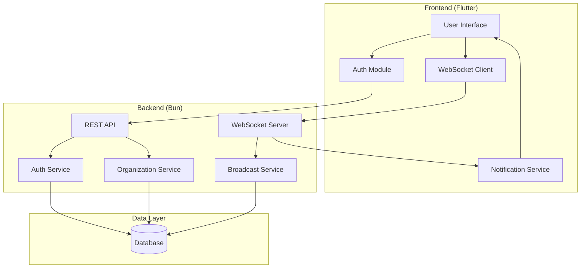
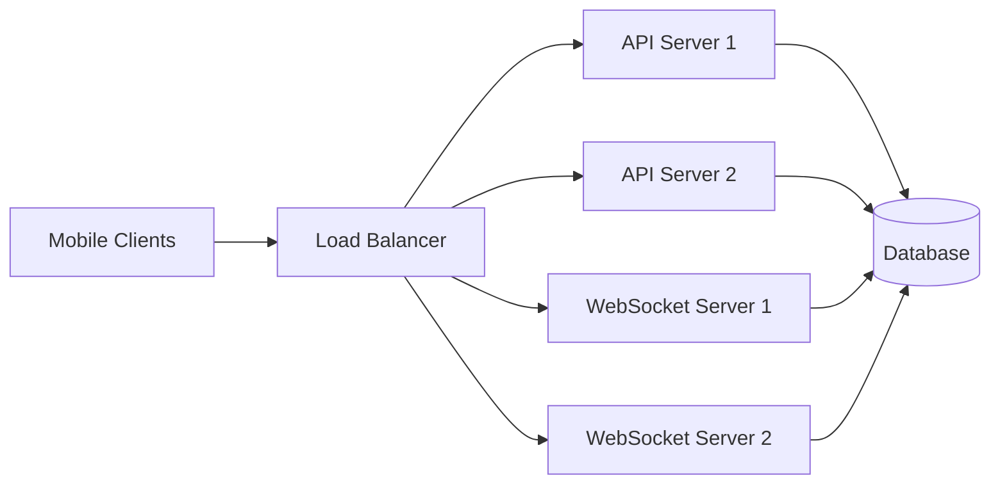

# Design Document

## Overview

Phantom Ping is a real-time group pager system built as a monorepo with a Flutter mobile frontend and Bun backend. The system enables hierarchical organization management with Owner, Admin, Supervisor, and Normal User roles. Organizations can create topic-based sub-meshes for targeted messaging with three severity levels (low, medium, high) that trigger different notification patterns.

## Architecture

### High-Level Architecture



### Technology Stack

**Frontend:**
- Flutter (Dart) for cross-platform mobile development
- WebSocket client for real-time message delivery
- Local storage for user preferences and message history
- Platform-specific notification APIs (vibration, sound, screen pulse)

**Backend:**
- Bun runtime with TypeScript
- WebSocket server for real-time communication
- REST API for CRUD operations
- SQLite or PostgreSQL for data persistence
- JWT for authentication

## Components and Interfaces

### Backend Components

#### 1. Authentication Service

**Responsibilities:**
- Validate PIN + Organization ID credentials
- Generate and verify access tokens (JWT)
- Generate and manage refresh tokens
- Handle token refresh flow
- Invalidate tokens on logout

**API Endpoints:**
```typescript
POST /api/auth/login
Body: { pin: string, organizationId: string }
Response: { 
  accessToken: string, 
  refreshToken: string,
  user: UserProfile 
}

POST /api/auth/refresh
Body: { refreshToken: string }
Response: { 
  accessToken: string, 
  refreshToken: string 
}

POST /api/auth/logout
Headers: { Authorization: Bearer <token> }
Body: { refreshToken: string }
Response: { success: boolean }
```

#### 2. Organization Service

**Responsibilities:**
- Create and manage organizations (validate unique organization IDs, max 15 characters)
- Handle user registration and role management
- Manage topics and user assignments
- Generate unique PINs for users within organizations
- Generate UUIDv7 for all entity IDs except organization ID

**API Endpoints:**
```typescript
POST /api/organizations
Body: { 
  organizationId: string, // User-provided, max 15 characters
  organizationName: string,
  ownerName: string, 
  ownerEmail: string 
}
Response: { 
  organizationId: string, 
  ownerId: string, // Auto-generated UUIDv7
  ownerPin: string 
}

POST /api/organizations/:orgId/users
Body: { name: string, email: string, role: 'normal' | 'admin' | 'supervisor' }
Response: { userId: string, pin: string }

PUT /api/organizations/:orgId/users/:userId/role
Body: { role: 'normal' | 'admin' | 'supervisor', topicId?: string }
Response: { success: boolean }

DELETE /api/organizations/:orgId/users/:userId
Response: { success: boolean }

PUT /api/organizations/:orgId/ownership
Body: { newOwnerId: string }
Response: { success: boolean }

POST /api/organizations/:orgId/topics
Body: { name: string }
Response: { topicId: string }

POST /api/organizations/:orgId/topics/:topicId/users
Body: { userId: string }
Response: { success: boolean }

GET /api/organizations/:orgId/topics
Response: { topics: Topic[] }
```

#### 3. Broadcast Service

**Responsibilities:**
- Handle message broadcasting
- Validate sender permissions (Owner/Admin can broadcast org-wide or to topics; Supervisors only to their assigned topics)
- Determine organization from authenticated user
- Deliver messages via WebSocket to appropriate recipients
- Track message acknowledgements

**API Endpoints:**
```typescript
POST /api/broadcast
Headers: { Authorization: Bearer <token> }
Body: {
  level: 'low' | 'medium' | 'high',
  title: string,
  message: string,
  code?: string,
  scope: 'organization' | 'topic', // Only for Owner/Admin; Supervisors automatically broadcast to their assigned topic
  topicId?: string // Required if scope is 'topic' and user is Owner/Admin; not needed for Supervisors
}
Response: { messageId: string, recipientCount: number }

Note: For Supervisors, the system automatically uses their assigned topic and ignores scope/topicId parameters

POST /api/messages/:messageId/acknowledge
Body: { userId: string }
Response: { success: boolean }

GET /api/messages/history
Query: { organizationId: string, userId: string, limit?: number }
Response: { messages: Message[] }
```

**WebSocket Events:**
```typescript
// Server -> Client
event: 'message:broadcast'
payload: {
  messageId: string,
  level: 'low' | 'medium' | 'high',
  title: string,
  message: string,
  code?: string,
  timestamp: string
}

// Client -> Server
event: 'message:acknowledge'
payload: {
  messageId: string,
  userId: string
}
```

#### 4. WebSocket Server

**Responsibilities:**
- Maintain persistent connections with clients
- Route broadcast messages to appropriate users
- Handle connection lifecycle (connect, disconnect, reconnect)

**Connection Management:**
- Authenticate connections using JWT
- Map user IDs to WebSocket connections
- Handle multiple connections per user (multiple devices)
- Implement heartbeat/ping-pong for connection health

### Frontend Components

#### 1. Authentication Module

**Responsibilities:**
- Handle login flow
- Store and manage JWT tokens
- Provide authentication state to app

**Screens:**
- Login screen (PIN + Organization ID input)
- Session management

#### 2. User Interface

**Admin/Owner Screens:**
- Organization dashboard
- User management (register, promote, demote, kick)
- Topic management (create, assign users, assign supervisors)
- Broadcast composer (select scope, level, compose message)
- Ownership transfer (Owner only)

**Supervisor Screens:**
- Topic dashboard
- Broadcast composer (topic-scoped only)

**Normal User Screens:**
- Message inbox (received broadcasts)
- Message detail view with acknowledge button
- Settings (notification status toggle)

#### 3. Notification Service

**Responsibilities:**
- Receive broadcast messages via WebSocket
- Trigger appropriate notifications based on severity level
- Manage notification lifecycle

**Notification Patterns:**
- **Low:** Vibrate only (single vibration pattern)
- **Medium:** Vibrate + screen pulse (repeated vibration + screen wake/flash)
- **High:** Vibrate + screen pulse + sound (continuous until acknowledged)

**Implementation:**
- Use Flutter's `vibration` package for haptic feedback
- Use `flutter_local_notifications` for persistent notifications
- Use `audioplayers` for sound playback
- Implement custom screen pulse using overlay widgets

#### 4. WebSocket Client

**Responsibilities:**
- Establish and maintain WebSocket connection
- Handle reconnection logic
- Parse incoming messages
- Send acknowledgements

**Connection Lifecycle:**
- Connect on app launch (if authenticated)
- Reconnect on network recovery
- Disconnect on logout
- Handle background/foreground transitions

## Data Models

### User

```typescript
interface User {
  id: string; // UUIDv7
  organizationId: string; // User-provided, max 15 characters
  name: string;
  email: string;
  pin: string; // Hashed
  role: 'owner' | 'admin' | 'supervisor' | 'normal';
  supervisorTopicId?: string; // UUIDv7 - Topic ID if role is supervisor (one topic per supervisor)
  notificationEnabled: boolean;
  createdAt: Date;
  updatedAt: Date;
}
```

### Organization

```typescript
interface Organization {
  id: string; // User-provided, max 15 characters
  name: string;
  ownerId: string; // UUIDv7
  createdAt: Date;
  updatedAt: Date;
}
```

### Topic

```typescript
interface Topic {
  id: string; // UUIDv7
  organizationId: string; // User-provided, max 15 characters
  name: string;
  createdAt: Date;
  updatedAt: Date;
}
```

### TopicMembership

```typescript
interface TopicMembership {
  id: string; // UUIDv7
  topicId: string; // UUIDv7
  userId: string; // UUIDv7
  createdAt: Date;
}
```

### Message

```typescript
interface Message {
  id: string; // UUIDv7
  organizationId: string; // User-provided, max 15 characters
  senderId: string; // UUIDv7
  level: 'low' | 'medium' | 'high';
  title: string;
  message: string;
  code?: string;
  scope: 'organization' | 'topic';
  topicId?: string; // UUIDv7
  createdAt: Date;
}
```

### MessageAcknowledgement

```typescript
interface MessageAcknowledgement {
  id: string; // UUIDv7
  messageId: string; // UUIDv7
  userId: string; // UUIDv7
  acknowledgedAt: Date;
}
```

### Database Schema

```sql
-- Users table
CREATE TABLE users (
  id TEXT PRIMARY KEY,
  organization_id TEXT NOT NULL,
  name TEXT NOT NULL,
  email TEXT NOT NULL,
  pin_hash TEXT NOT NULL,
  role TEXT NOT NULL CHECK(role IN ('owner', 'admin', 'supervisor', 'normal')),
  supervisor_topic_id TEXT, -- Only set if role is supervisor
  notification_enabled BOOLEAN DEFAULT TRUE,
  created_at TIMESTAMP DEFAULT CURRENT_TIMESTAMP,
  updated_at TIMESTAMP DEFAULT CURRENT_TIMESTAMP,
  UNIQUE(organization_id, pin_hash),
  FOREIGN KEY (supervisor_topic_id) REFERENCES topics(id) ON DELETE SET NULL
);

-- Refresh tokens table
CREATE TABLE refresh_tokens (
  id TEXT PRIMARY KEY,
  user_id TEXT NOT NULL,
  token_hash TEXT NOT NULL,
  expires_at TIMESTAMP NOT NULL,
  created_at TIMESTAMP DEFAULT CURRENT_TIMESTAMP,
  FOREIGN KEY (user_id) REFERENCES users(id) ON DELETE CASCADE
);

-- Organizations table
CREATE TABLE organizations (
  id TEXT PRIMARY KEY CHECK(length(id) <= 15), -- User-provided, max 15 characters
  name TEXT NOT NULL,
  owner_id TEXT NOT NULL, -- UUIDv7
  created_at TIMESTAMP DEFAULT CURRENT_TIMESTAMP,
  updated_at TIMESTAMP DEFAULT CURRENT_TIMESTAMP,
  FOREIGN KEY (owner_id) REFERENCES users(id)
);

-- Topics table
CREATE TABLE topics (
  id TEXT PRIMARY KEY,
  organization_id TEXT NOT NULL,
  name TEXT NOT NULL,
  created_at TIMESTAMP DEFAULT CURRENT_TIMESTAMP,
  updated_at TIMESTAMP DEFAULT CURRENT_TIMESTAMP,
  FOREIGN KEY (organization_id) REFERENCES organizations(id) ON DELETE CASCADE
);


-- Topic memberships (many-to-many)
CREATE TABLE topic_memberships (
  id TEXT PRIMARY KEY,
  topic_id TEXT NOT NULL,
  user_id TEXT NOT NULL,
  created_at TIMESTAMP DEFAULT CURRENT_TIMESTAMP,
  UNIQUE(topic_id, user_id),
  FOREIGN KEY (topic_id) REFERENCES topics(id) ON DELETE CASCADE,
  FOREIGN KEY (user_id) REFERENCES users(id) ON DELETE CASCADE
);

-- Messages table
CREATE TABLE messages (
  id TEXT PRIMARY KEY,
  organization_id TEXT NOT NULL,
  sender_id TEXT NOT NULL,
  level TEXT NOT NULL CHECK(level IN ('low', 'medium', 'high')),
  title TEXT NOT NULL,
  message TEXT NOT NULL,
  code TEXT,
  scope TEXT NOT NULL CHECK(scope IN ('organization', 'topic')),
  topic_id TEXT,
  created_at TIMESTAMP DEFAULT CURRENT_TIMESTAMP,
  FOREIGN KEY (organization_id) REFERENCES organizations(id) ON DELETE CASCADE,
  FOREIGN KEY (sender_id) REFERENCES users(id),
  FOREIGN KEY (topic_id) REFERENCES topics(id) ON DELETE CASCADE
);

-- Message acknowledgements table
CREATE TABLE message_acknowledgements (
  id TEXT PRIMARY KEY,
  message_id TEXT NOT NULL,
  user_id TEXT NOT NULL,
  acknowledged_at TIMESTAMP DEFAULT CURRENT_TIMESTAMP,
  UNIQUE(message_id, user_id),
  FOREIGN KEY (message_id) REFERENCES messages(id) ON DELETE CASCADE,
  FOREIGN KEY (user_id) REFERENCES users(id) ON DELETE CASCADE
);

-- Indexes for performance
CREATE INDEX idx_users_org ON users(organization_id);
CREATE INDEX idx_topics_org ON topics(organization_id);
CREATE INDEX idx_messages_org ON messages(organization_id);
CREATE INDEX idx_messages_topic ON messages(topic_id);
CREATE INDEX idx_topic_memberships_user ON topic_memberships(user_id);
CREATE INDEX idx_topic_memberships_topic ON topic_memberships(topic_id);
CREATE INDEX idx_refresh_tokens_user ON refresh_tokens(user_id);
CREATE INDEX idx_refresh_tokens_hash ON refresh_tokens(token_hash);
```

## Error Handling

### Backend Error Responses

```typescript
interface ErrorResponse {
  error: {
    code: string;
    message: string;
    details?: any;
  };
}
```

**Error Codes:**
- `AUTH_INVALID_CREDENTIALS`: Invalid PIN or Organization ID
- `AUTH_UNAUTHORIZED`: Missing or invalid token
- `AUTH_FORBIDDEN`: Insufficient permissions
- `ORG_NOT_FOUND`: Organization does not exist
- `ORG_ID_TOO_LONG`: Organization ID exceeds 15 characters
- `ORG_ID_EXISTS`: Organization ID already exists
- `USER_NOT_FOUND`: User does not exist
- `TOPIC_NOT_FOUND`: Topic does not exist
- `ROLE_CONFLICT`: Cannot be Admin and Supervisor simultaneously
- `PERMISSION_DENIED`: User lacks required permissions
- `INVALID_INPUT`: Validation error on request data
- `SERVER_ERROR`: Internal server error

### Frontend Error Handling

**Network Errors:**
- Display retry mechanism for failed requests
- Show offline indicator when WebSocket disconnects
- Queue acknowledgements for retry when connection restored

**Permission Errors:**
- Display appropriate error messages
- Redirect to login if session expired
- Disable UI elements for unauthorized actions

**Validation Errors:**
- Show inline validation messages
- Prevent form submission until valid

## Testing Strategy

### Backend Testing

**Unit Tests:**
- Authentication logic (PIN validation, JWT generation)
- Role permission checks
- Message routing logic
- Data model validation

**Integration Tests:**
- API endpoint flows
- WebSocket message delivery
- Database operations
- Role-based access control

**Test Tools:**
- Bun's built-in test runner
- Mock WebSocket connections
- In-memory database for tests

### Frontend Testing

**Unit Tests:**
- Authentication state management
- Notification service logic
- Message parsing and formatting

**Widget Tests:**
- UI component rendering
- User interaction flows
- Form validation

**Integration Tests:**
- End-to-end user flows (login, receive message, acknowledge)
- WebSocket connection handling
- Notification triggering

**Test Tools:**
- Flutter's testing framework
- `mockito` for mocking dependencies
- `integration_test` package for E2E tests

### Manual Testing Scenarios

1. **Organization Setup:** Create org, register users, assign roles
2. **Broadcasting:** Send messages at different levels to different scopes
3. **Notifications:** Verify correct notification patterns for each level
4. **Role Management:** Promote/demote users, transfer ownership
5. **Topic Management:** Create topics, assign users and supervisors
6. **Acknowledgement:** Verify notifications stop after acknowledgement
7. **Multi-device:** Test same user on multiple devices
8. **Offline/Online:** Test reconnection and message delivery after network loss

## Security Considerations

### Authentication
- PINs hashed using bcrypt before storage
- Access tokens (JWT) with short expiration (15 minutes)
- Refresh tokens with longer expiration (7 days), stored in database
- Automatic token refresh on access token expiration
- Refresh tokens invalidated on logout
- Rate limiting on login attempts

### Authorization
- Role-based access control enforced on all endpoints
- Verify organization membership before any operation
- Validate topic permissions for supervisors
- Owner-only operations strictly enforced

### Data Protection
- HTTPS/WSS for all communications
- Input validation and sanitization
- SQL injection prevention (parameterized queries)
- XSS prevention in message content

### WebSocket Security
- Authenticate WebSocket connections with JWT
- Validate message sender permissions
- Rate limiting on broadcast frequency
- Connection timeout and cleanup

## Performance Considerations

### Backend Optimization
- Connection pooling for database
- Index optimization for frequent queries
- Message batching for bulk broadcasts
- WebSocket connection limits per server

### Frontend Optimization
- Lazy loading for message history
- Efficient notification scheduling
- Background task management
- Battery optimization for persistent connections

### Scalability
- Horizontal scaling of WebSocket servers
- Load balancing for API servers
- Database read replicas for queries
- Message queue for broadcast distribution (future enhancement)

## Deployment Architecture



**Infrastructure:**
- API servers: Stateless, horizontally scalable
- WebSocket servers: Stateful, sticky sessions
- Database: Primary with read replicas
- Load balancer: NGINX or cloud provider LB
- Monitoring: Logging and metrics collection
